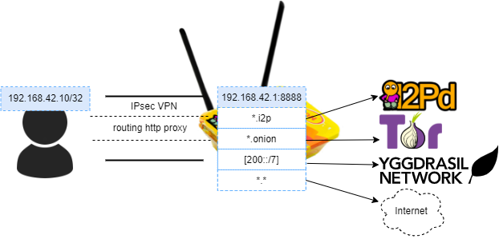

# Rollter
IPsec VPN server with i2p onion and yggdrasil routing

WEB serfing with no limits. Open any sites: onion, i2p and yggdrasil too!

Based on [IPsec VPN server by hwdsl2](https://github.com/hwdsl2/docker-ipsec-vpn-server)


## Requirements
- docker server
## How does it works?


## Start server
```sh
docker run \
    --name rollter \
    -e VPN_IPSEC_PSK=your_ipsec_pre_shared_key \
    -e VPN_USER=your_vpn_username \
    -e VPN_PASSWORD=your_vpn_password \
    -p 500:500/udp \
    -p 4500:4500/udp \
    -d --privileged \
    thedmdim/rollter
```

Then, to access TOR/I2P, connect to `http://192.168.42.1:8888`
### In Windows 10:
1. Set up a manual VPN l2tp/IPsec connection on Windows 10
2. Go to Network Connections > VPN
3. Select your just created VPN connection and click Advanced options
4. Scroll down to VPN proxy settings
5. Select manual setup
6. Enter 192.168.42.1:8888
7. Connect to the VPN
### iOS
1. Go Settings -> General -> VPN
2. Select L2TP connection
3. Scroll down to proxy settings
4. Select manual
5. Enter 192.168.42.1:8888
7. Connect to the VPN
